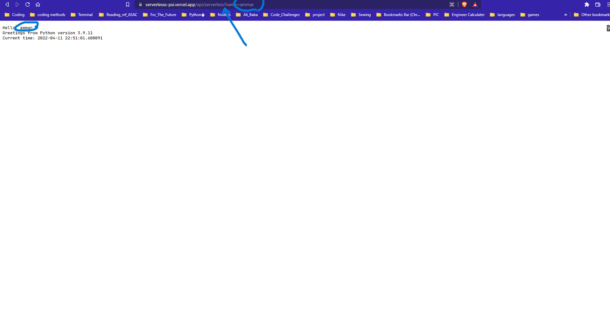

# Serverless API

this app is a serverless application, and provides a simple function of printing a message to the page

## Method:

    do_Get(): will handle GET requests

## How to use this app:

all you have to do is print the name in URL and will print a welcome message in the requested Page; Dont forget to add the name after the euqals sign

## Link to the app

![vercel-app][https://serverlesss-psi.vercel.app/api/serverless?name=]
